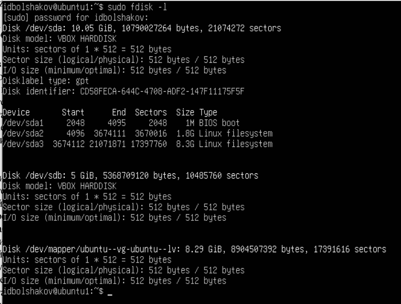

# Отчет по практической части лабораторной работы №3

## Часть 1

### 1.1 Добавьте в виртуальную машину с операционной системой Linux виртуальный жесткий диск (делается это в настройках виртуальной машины).


### 1.2 Запустите виртуальную машину с операционной системой Linux.
Запуск виртуальной машины осуществлялся из графического интерфейса программы `VirtualBox`.

### 1.3 Ознакомьтесь с командой fdisk и ее возможностями из справочной документации.


### 1.4 Создайте таблицу разделов (3 первичных и 1 логический) с помощью команды fdisk на добавленном виртуальном диске (обычно это диск /dev/sdb).


### 1.5 Запишите изменения на диск


### 1.6 Проверьте факт создания разделов используя команду fdisk. ( Так же, создание разделов можно проверить используя команду ls /dev/sd* )


### 1.7 Отформатируйте созданные разделы в файловую систему ext4.


### 1.8 Ознакомьтесь с командами mount и umount и их возможностями из справочной документации.
Ознакомление с командами `mount` и `umount` выполнялось с помощью команд:

* `man mount`
* `main umount`

### 1.9 Смонтируйте созданные разделы и создайте там произвольные файлы.


### 1.10 Сделайте резервную копию MBR с помощью утилиты DD.


### 1.11 Сотрите таблицу разделов MBR с помощью утилиты DD.


### 1.12 Восстановите MBR с помощью утилиты DD.


### 1.13 Смонтируйте разделы и проверьте целостность данных.


### 1.14 Отмонтируйте разделы.
Отмонтирование разделов произведено с помощью команды `umount`:

```sh
sudo umount /mnt/sdb1;
sudo umount /mnt/sdb2;
sudo umount /mnt/sdb5;
```

### 1.15 Установите gdisk ( sudo apt-get install gdisk )


### 1.16 Создайте таблицу разделов GPT (5 первичных разделов) с помощью gdisk.


### 1.17 Отформатируйте созданные разделы в файловую систему ext3.


### 1.18 Смонтируйте созданные разделы и создайте там произвольные файлы.


### 1.19 Сделайте резервную копию GPT с помощью утилиты DD, предварительно определив необходимое количество байт для резервной копии.


### 1.20 Сотрите GPT с помощью утилиты DD.


### 1.21 Восстановите GPT с помощью утилиты DD.


### 1.22 Смонтируйте разделы и проверьте целостность данных.


### 1.23 Отмонтируйте разделы.
Отмонтирование разделов произведено с помощью команды `umount`:

```sh
sudo umount /mnt/sdb1;
sudo umount /mnt/sdb2;
sudo umount /mnt/sdb3;
sudo umount /mnt/sdb4;
sudo umount /mnt/sdb5;
```

### 1.24 Определите достоинства и недостатки таблиц разделов MBR и GPT.
#### MBR (Master Boot Record)  
Достоинства:  

- Совместимость: Поддерживается большинством старых операционных систем и BIOS.  
- Простота: Легкость в управлении и понимании структуры.  

Недостатки:  

- Ограничение размера диска: Поддерживает диски до 2 ТБ.  
- Максимальное количество основных разделов: До 4 первичных разделов (можно обойти через расширенный раздел).  
- Уязвимость: Если MBR повреждается, загрузка системы становится невозможной.  


#### GPT (GUID Partition Table)  
Достоинства:  

- Большой размер дисков: Поддерживает диски размером свыше 2 ТБ.  
- Количество разделов: Теоретически поддерживает до 128 разделов (зависит от ОС).  
- Надежность: Хранятся несколько копий таблицы разделов, что снижает риск потери данных.  
- UEFI: Полная поддержка UEFI, что обеспечивает улучшенную безопасность и скорость загрузки.  

Недостатки: 
 
- Несовместимость: Старые системы с BIOS могут не поддерживать GPT.  
- Сложнее управление: Более сложная структура требует специализированных инструментов для работы.


## Часть 2

### 2.1 Добавьте в виртуальную машину виртуальный жесткий диск.


### 2.2 Запустите виртуальную машину с Linux.
Запуск виртуальной машины осуществлялся из графического интерфейса программы `VirtualBox`.

### 2.3 Запустите fdisk (gdisk или parted) и создайте таблицу разделов MBR с разделами.


### 2.4 Отформатируйте созданные разделы в файловую систему ext4.


### 2.5 Установите TestDisk.
Установка производилась с помощью команды `sudo apt install testdisk`

### 2.6 Удалите MBR (или таблицу разделов) с помощью команды DD.


### 2.7 Восстановите MBR (или таблицу разделов) с помощью TestDisk.


### 2.8 Смонтируйте восстановленные разделы и создайте там произвольные файлы.


### 2.9 Удалите созданные файлы.


### 2.10 С помощью TestDisk восстановите данные.


### 2.11 Создайте произвольный каталог и запишите туда данные каталога /var/log/ .


### 2.12 Удалите данные с созданного каталога.
Удаление производилось командой `rm`:

```sh
rm sdb_gpt_backup2;
```

### 2.13 С помощью PhotoRec восстановит  данные.


