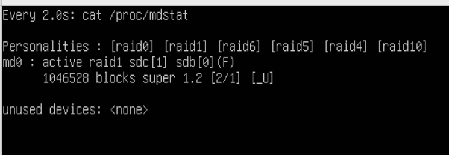
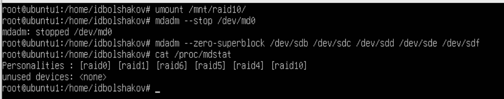

# Отчет по практической части лабораторной работы №4

## Часть 1

### 1.1 Добавить пять виртуальных жестких дисков.


### 1.2 Запустить Linux.
Запуск виртуальной машины осуществлялся из графического интерфейса программы `VirtualBox`.

### 1.3 Установить mdadm.


### 1.4 Ознакомится с утилитой mdadm, ее возможностями и параметрами.
Инструкция по работе с утилитой была прочитана с помощью команды `man mdadm`.

### 1.5 В отдельном терминале следить за состоянием файла /proc/mdstat


### 1.6 Собрать RAID 1 с помощью mdadm.


### 1.7 Создать на созданном RAID файловую систему ext4.


### 1.8 Смонтировать созданную файловую систему.


### 1.9 Записать туда файл raid.txt с произвольным содержимым.


### 1.10 Разрушить один из дисков RAID и проследить за происходящим в файле /proc/mdstat



### 1.11 Проверить целостность файла raid.txt


### 1.12 Остановить RAID 1.


### 1.13 Очистить информацию дисков о принадлежности к программному RAID.
Очистка выполнялась с помощью команды `mdadm --zero-superblock`:

```
sudo mdadm --zero-superblock /dev/sdb;
sudo mdadm --zero-superblock /dev/sdc;
```

### 1.14 Собрать RAID 0 с помощью mdadm.


### 1.15 Создать на созданном RAID файловую систему ext3.


### 1.16 Смонтировать созданную файловую систему.


### 1.17 Записать туда файл raid.txt с произвольным содержимым.


### 1.18 Разрушить один из дисков RAID и проследить за происходящим в файле /proc/mdstat


### 1.19 Проверить целостность файла raid.txt


### 1.20 Остановить RAID 0.
Очистка выполнялась с помощью команды `mdadm --stop`:

```
sudo mdadm --stop /dev/md1;
```

### 1.21 Очистить информацию дисков о принадлежности к программному RAID.
Очистка выполнялась с помощью команды `mdadm --zero-superblock`:

```
sudo mdadm --zero-superblock /dev/sdb;
sudo mdadm --zero-superblock /dev/sdc;
```

### 1.22 Собрать RAID 5 с диском горячей замены с помощью mdadm.


### 1.23 Создать на созданном RAID файловую систему ext4.


### 1.24 Смонтировать созданную файловую систему.


### 1.25 Записать туда файл raid.txt с произвольным содержимым.


### 1.26 Разрушить три диска RAID и проследить за происходящим в файле /proc/mdstat


### 1.27 Проверить целостность файла raid.txt


### 1.28 Остановить RAID 5.


### 1.29 Очистить информацию дисков о принадлежности к программному RAID.
Очистка выполнялась с помощью команды `mdadm --zero-superblock`:

```
sudo mdadm --zero-superblock /dev/sdb;
sudo mdadm --zero-superblock /dev/sdc;
sudo mdadm --zero-superblock /dev/sdd;
sudo mdadm --zero-superblock /dev/sde;
```

### 1.30 Собрать RAID 10 с диском горячей замены с помощью mdadm.


### 1.31 Создать на созданном RAID файловую систему ext2.


### 1.32 Смонтировать созданную файловую систему.


### 1.33 Записать туда файл raid.txt с произвольным содержимым.


### 1.34 Разрушить два диска RAID и проследить за происходящим в файле /proc/mdstat


### 1.35 Проверить целостность файла raid.txt


### 1.36 Остановить RAID 10.


### 1.37 Очистить информацию дисков о принадлежности к программному RAID.


## Часть 2

### 2.1 Инициализировать физические диски, поверх которых будет создан LVM.


### 2.2 Создать группу томов на основе четырех виртуальных жестких дисков.


### 2.3 Создать логический том.


### 2.4 На созданном логическом томе создать файловую систему.


### 2.5 Смонтировать систему и создать файл файл LVM.txt.


### 2.6 Добавить в группу томов еще один виртуальный жесткий диск.


### 2.7 Определить количество добавленных экстентов.


### 2.8 Расширить созданный логический том на размер добавленных экстентов.


### 2.9 Увеличить размер файловой системы.


### 2.10 Сделать снапшот логического тома.


### 2.11 Удалить группу томов и снапшот.
