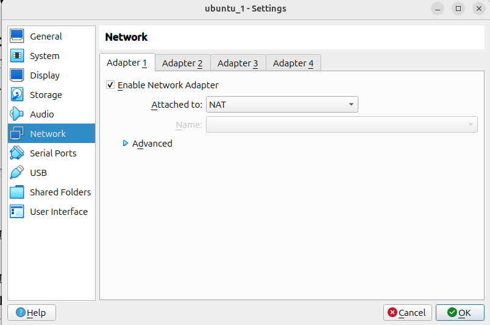

# Отчет по практической части лабораторной работы №5

## Часть 1: Создание виртуальной сети Host-Only

### 1.1 Откройте VirtualBox Manager.


### 1.2 Перейдите в меню Файл → Менеджер сетей.


### 1.3 Во вкладке Host-only сети (Виртуальные сети) нажмите кнопку Создать (иконка с плюсом), чтобы добавить новую виртуальную сеть.


### 1.4 Убедитесь, что созданная сеть имеет имя, например, HostNetwork.


### 1.5 Выберите созданную сеть и нажмите кнопку Редактировать.


### 1.6 В настройках сети установите следующие параметры:
```
IPv4-адрес: 192.168.56.1
Маска подсети IPv4: 255.255.255.0
Убедитесь, что опция Включить сервер DHCP отключена, так как мы будем
использовать статическую настройку IP-адресов.
```


## Часть 2: Настройка сетевых адаптеров виртуальных машин

### 2.1 Первая виртуальная машина:

* Откройте настройки виртуальной машины.
* Перейдите в раздел Сеть.
* Адаптер 1: - Включите адаптер. - Установите Тип подключения: NAT (для доступа в интернет).
* Адаптер 2: - Включите адаптер. - Установите Тип подключения: Host-only адаптер
(Виртуальная сеть). - В поле Имя выберите созданную сеть HostNetwork.


### 2.2 Вторая виртуальная машина:
Повторите те же шаги, что и для первой машины.


## Часть 3: Конфигурация сетевых настроек в виртуальных машинах
### 3.1 Запустите каждую виртуальную машину и откройте терминал.


### 3.2 Отредактируйте файл yaml сетевой конфигурации в каталоге: /etc/netplan/
#### Первая виртуальная машина:


#### Вторая виртуальная машина:


### 3.3 Сохраните файл и примените настройки:


### 3.4 Убедитесь, что статические IP-адреса установлены:


### 3.5 Проверьте связь между машинами:


### 3.6 Проверка доступа в интернет


