# Отчет по практической части лабораторной работы №6

## Шаг 1: Установка и настройка сервисов на VM2

### 1.1 Обновите пакеты системы:
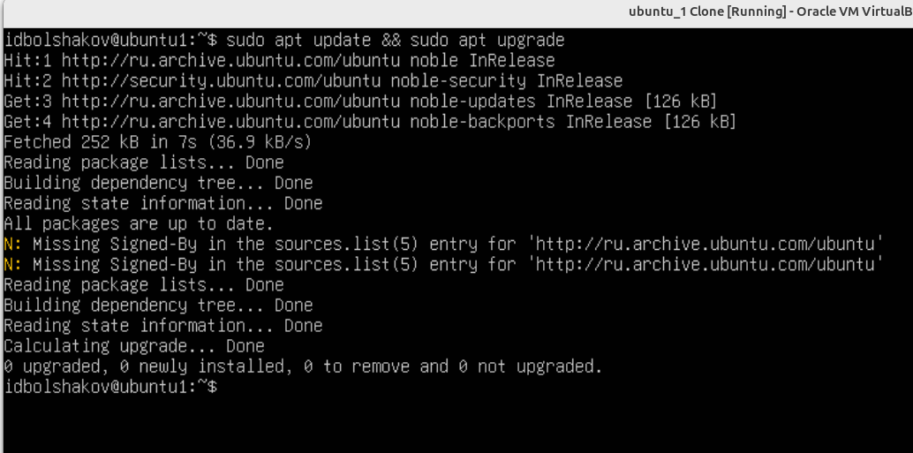

### 1.2 Установите nginx:
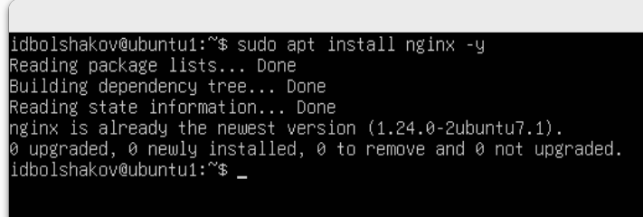

### 1.3 Установите SSH-сервер:
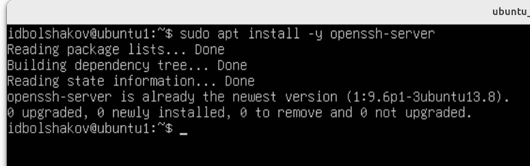

### 1.4 Убедитесь, что сервисы запущены:
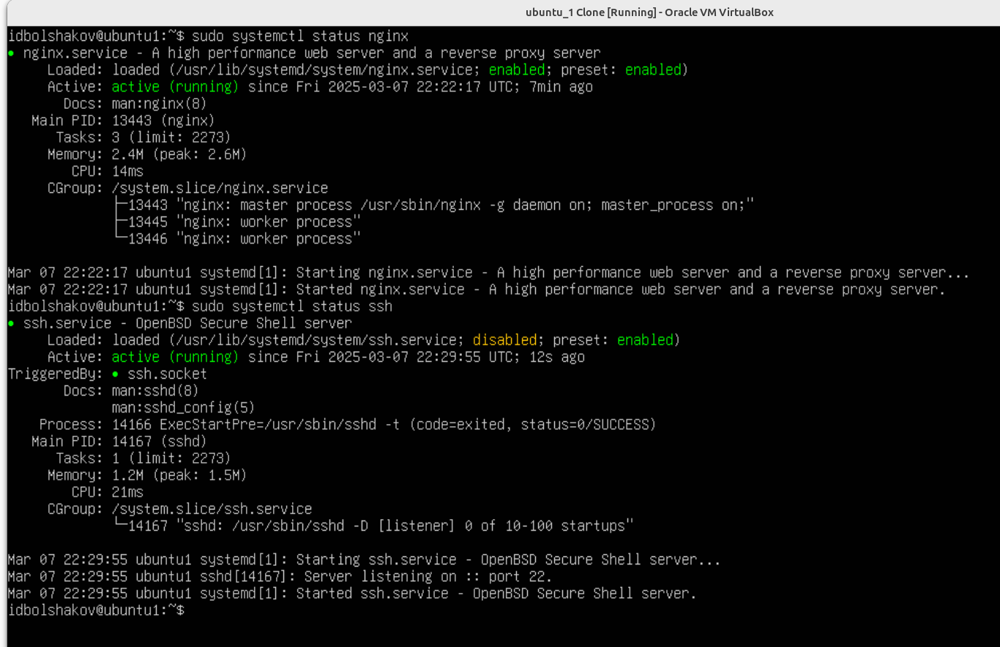

### 1.5 Проверьте доступность сервисов с VM1:
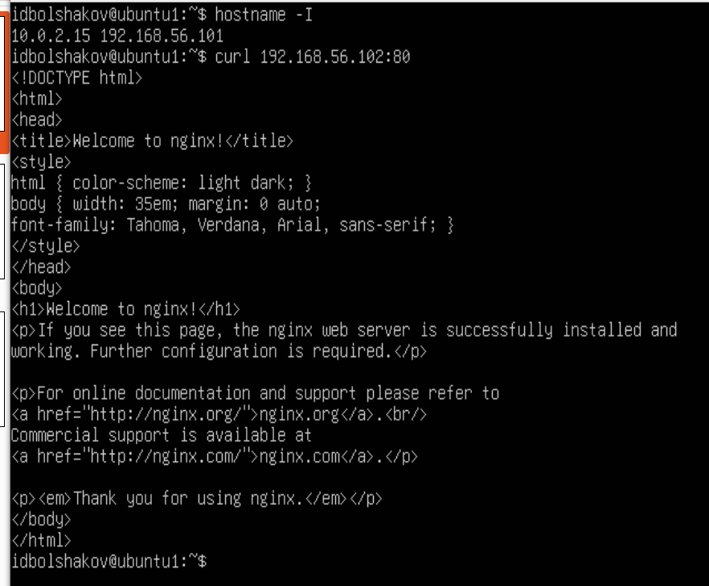
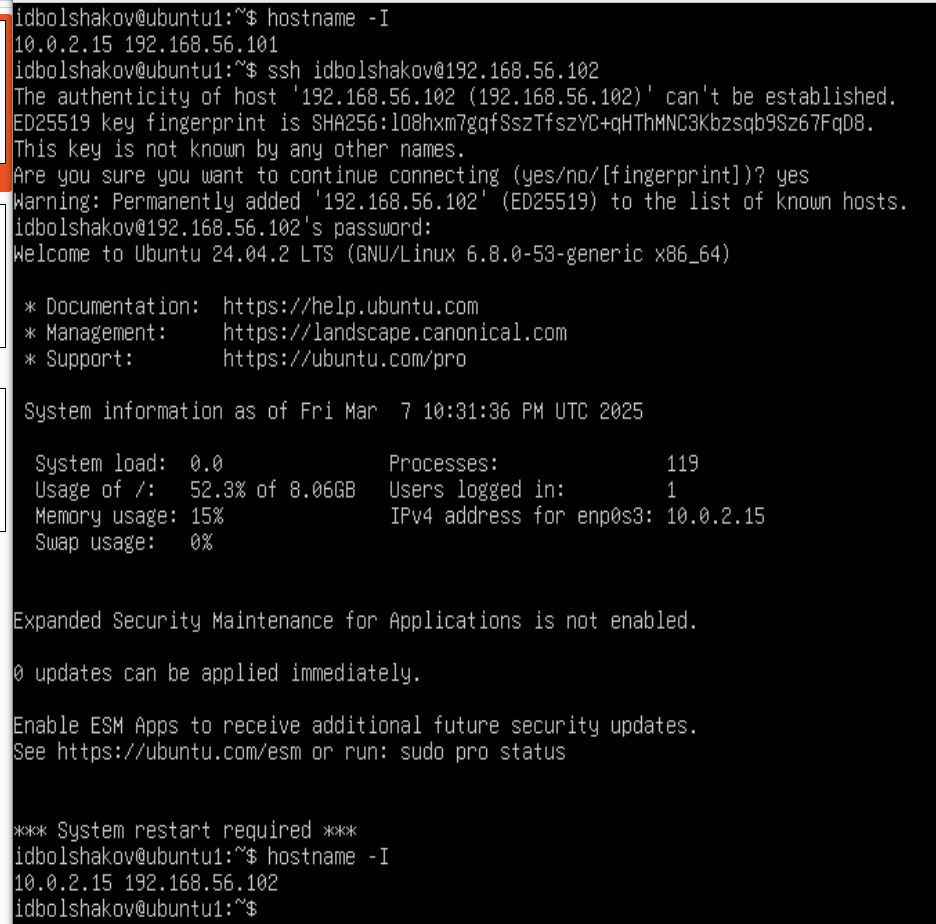

## Шаг 2: Сканирование VM2 с помощью Nmap на VM1

### 2.1 Установите Nmap на VM1 (если не установлен)
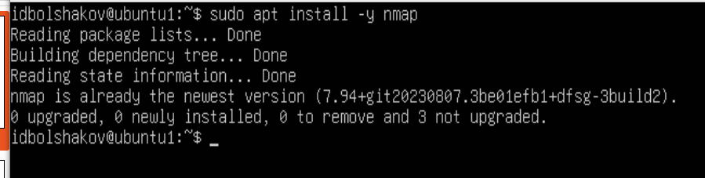

### 2.2 Выполните простое сканирование портов:
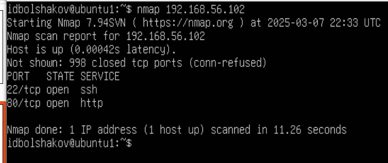

### 2.3 Выполните сканирование с определением операционной системы и версий сервисов:
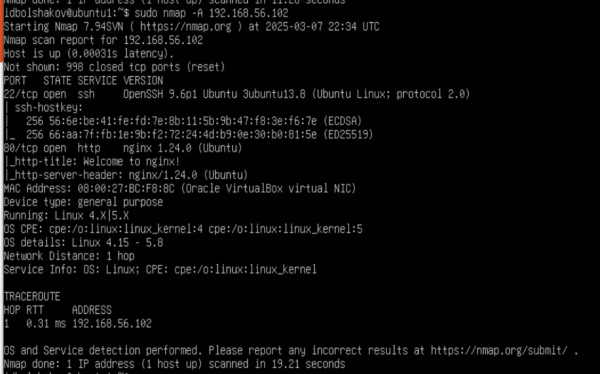

### 2.4 Используйте TCP SYN сканирование:
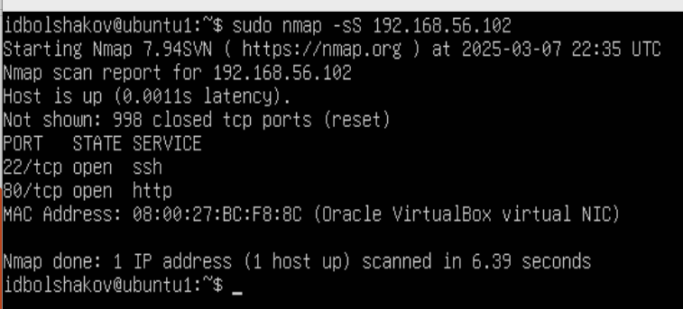

### 2.5 Выполните UDP сканирование:
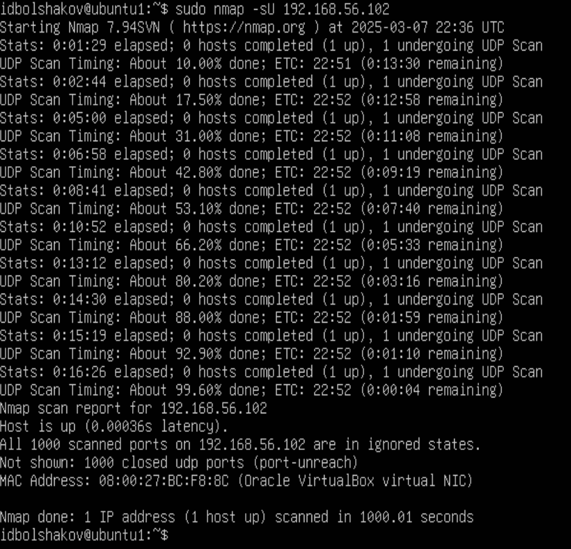

### 2.6 Попробуйте сканирование скрытых портов:
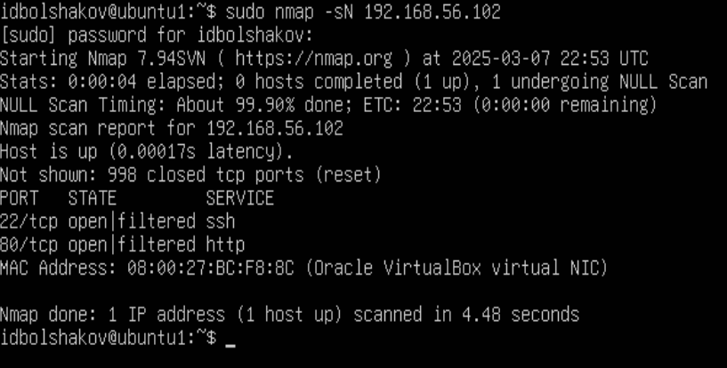

### 2.7 Проанализируйте результаты каждого сканирования и отметьте открытые порты и обнаруженные сервисы.
При сканировании `.102` виртуальной машины не обнаружено неожиданно открытых портов. Были доступны только явно открытый 80-ый и 22-ый порты.

## Шаг 3: Настройка брандмауэра UFW на VM2

### 3.1 Активируйте UFW
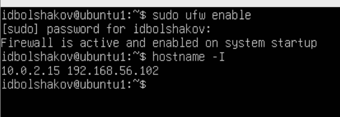

### 3.2 По умолчанию разрешите входящие подключения на необходимые порты
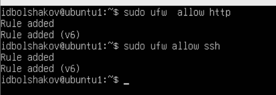

### 3.3 Запретите доступ к VM2 с IP-адреса VM1 (192.168.56.101)
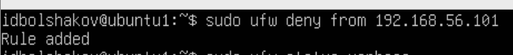

### 3.4 Проверьте статус UFW
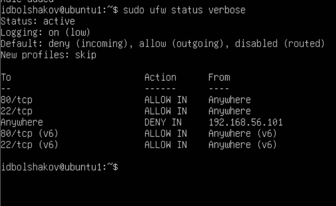

### 3.5 Попытайтесь получить доступ к nginx и SSH с VM1
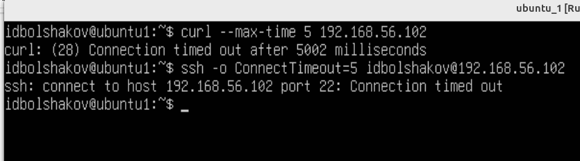

### 3.6 Просканируйте VM2 с VM1 с помощью Nmap и убедитесь, что порты недоступны
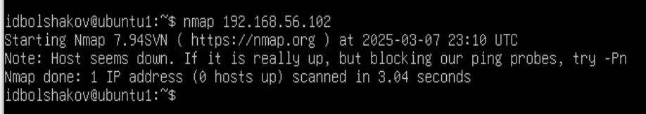

## Шаг 4: Открытие порта 80 на VM2

### 4.1 Разрешите входящие подключения на порт 80 для всех IP
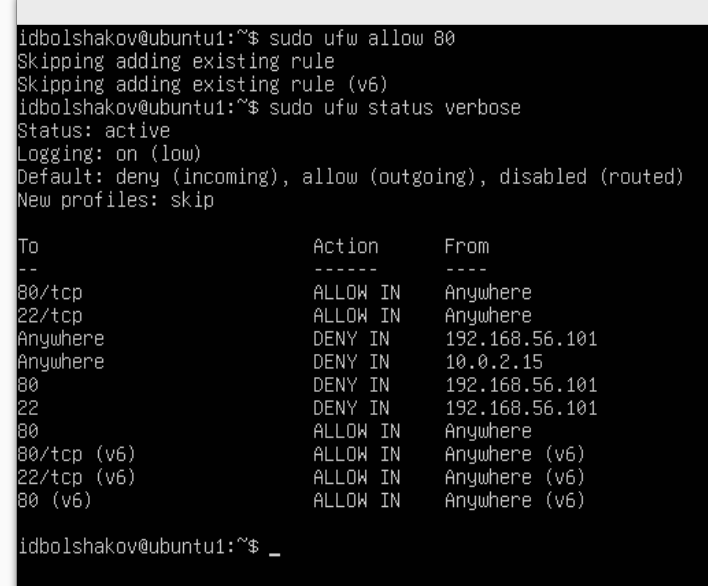

### 4.2 Проверьте статус UFW

### 4.3 Попытайтесь снова получить доступ к nginx с VM1
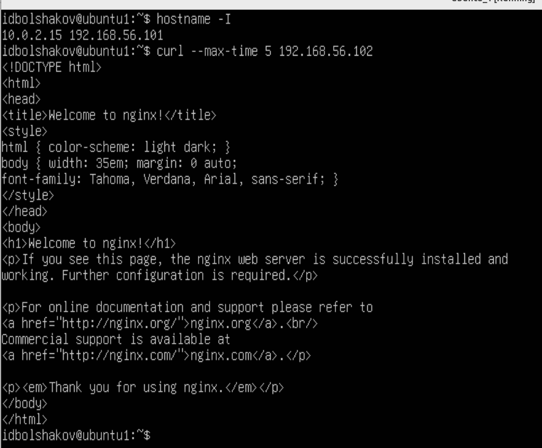

### 4.4 Повторно просканируйте VM2 с VM1 с помощью Nmap
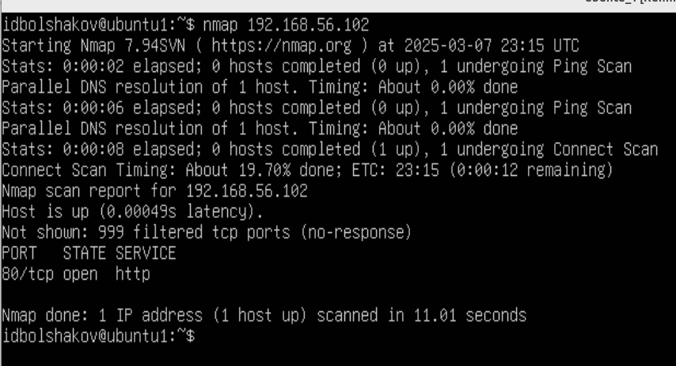
