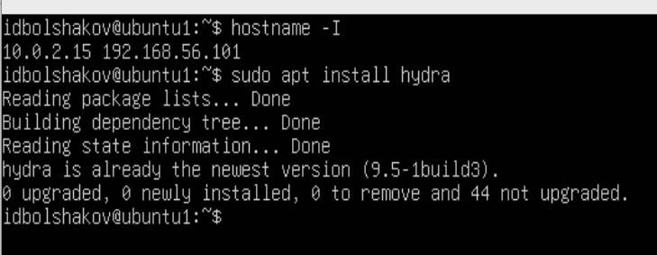
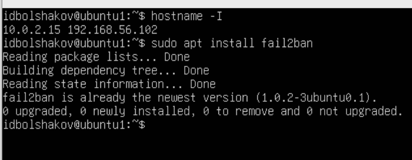
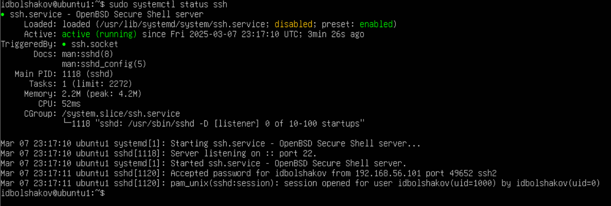
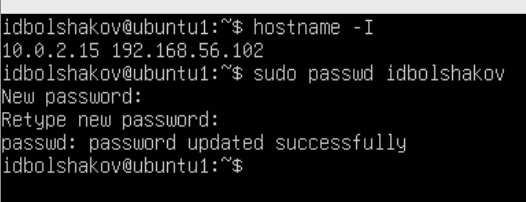
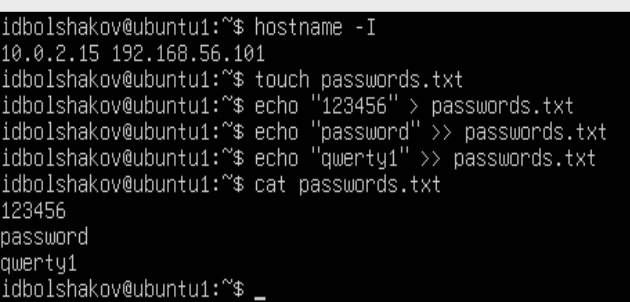
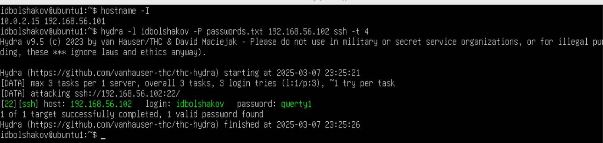
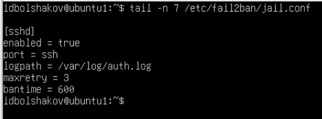
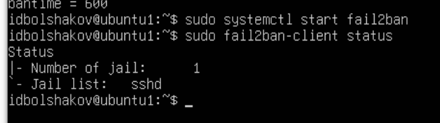
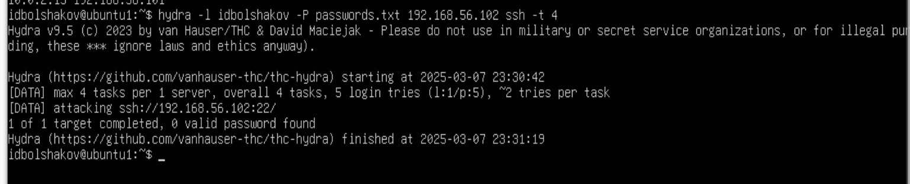
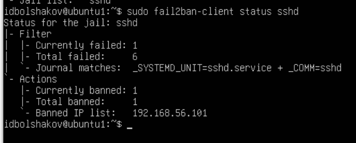

# Отчет по практической части лабораторной работы №7

## Шаг 1: Подготовка среды

### 1.1 Создание двух виртуальных машин:
Виртуальные машины создавались с помощью `VirtualBox`.

### 1.2 Установка необходимых инструментов:
#### Атакующая машина (Hydra):

#### Защищающаяся машина (Fail2ban):

## Шаг 2: Смена пароля на защищающейся машине

### 2.1 Для демонстрации атаки смените пароль пользователя на защищающейся машине на простой, который можно легко сбрутить:

## Шаг 3: Формирование словарей паролей для brute-force атаки

### 3.1 На атакующей машине создайте файл со списком паролей (passwords.txt), который будет использоваться для brute-force атаки:

## Шаг 4: Атака на SSH с использованием Hydra

### 4.1 Используйте Hydra на атакующей машине для выполнения brute-force атаки на защищающуюся машину:

## Шаг 5: Настройка защиты с использованием Fail2ban

### 5.1 Конфигурация Fail2ban для защиты SSH на защищающейся машине:

### 5.2 Запуск Fail2ban:

## Шаг 6: Тестирование защиты

### 6.1 Проведите brute-force атаку с помощью Hydra на защищающуюся машину:

### 6.2 Убедитесь, что после нескольких неудачных попыток Fail2ban блокирует ваш IP-адрес:

## Заключение:

Fail2ban — эффективный инструмент защиты от brute-force атак благодаря следующим преимуществам:

1. Мониторинг журналов: Автоматически отслеживает попытки неудачных входов через журналы системы.
   
2. Блокировка IP-адресов: Блокирует подозрительные IP-адреса после определенного количества попыток входа.

3. Настройка правил: Позволяет гибко настраивать правила для различных сервисов (SSH, FTP, веб-приложения).

4. Простота интеграции: Легко интегрируется с популярными серверами и сервисами.

Эффективность против простых словарей:

- Для защиты от атак с использованием простых словарей Fail2ban эффективен, поскольку быстро блокирует злоумышленников до того, как они смогут перебрать большое количество комбинаций.
  
Однако:

- Против сложных атак с использованием продвинутых методов (например, распределенных атак) Fail2ban менее эффективен без дополнительной настройки и комбинирования с другими мерами безопасности.

Вывод: Fail2ban отлично справляется с простыми атаками, но требует дополнительных мер для защиты от более сложных угроз.

